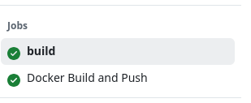
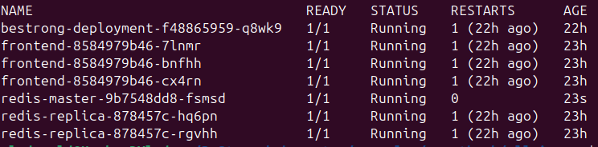
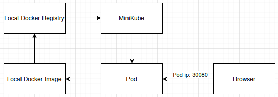

* [ASP.NET Core WebApi Sample with HATEOAS, Versioning &amp; Swagger](#aspnet-core-webapi-sample-with-hateoas-versioning--swagger)
   * [Versions](#versions)
   * [GET all Foods](#get-all-foods)
   * [GET single food](#get-single-food)
   * [POST a foodItem](#post-a-fooditem)
   * [PUT a foodItem](#put-a-fooditem)
   * [PATCH a foodItem](#patch-a-fooditem)
   * [DELETE a foodItem](#delete-a-fooditem)
* [Report](#report)
   * [Description](#description)
   * [how to start](#how-to-start)
   * [Screenshots](#screenshots)
* [Report 24.04.25](#report-240425)
   * [The first task ](#the-first-task)
   * [Task two](#Task-two)
   * [Task three](#Task-three)
* [Report 02.05.25](#report-020525)
   * [System context diagram](#system-context-diagram)
   * [Container diagram](#Container-diagram)
   * [Component diagram](#Component-diagram)

# ASP.NET Core WebApi Sample with HATEOAS, Versioning & Swagger

In this repository I want to give a plain starting point at how to build a WebAPI with ASP.NET Core.

This repository contains a controller which is dealing with FoodItems. You can GET/POST/PUT/PATCH and DELETE them.

Hope this helps.

See the examples here: 

## Versions

``` http://localhost:29435/swagger ```


## GET all Foods

``` http://localhost:29435/api/v1/foods ```


## GET single food

``` http://localhost:29435/api/v1/foods/2 ```


## POST a foodItem

``` http://localhost:29435/api/v1/foods ```

```javascript
  {
      "name": "Lasagne",
      "type": "Main",
      "calories": 3000,
      "created": "2017-09-16T17:50:08.1510899+02:00"
  }
```


## PUT a foodItem

``` http://localhost:29435/api/v1/foods/5 ```

``` javascript
{
    "name": "Lasagne2",
    "type": "Main",
    "calories": 3000,
    "created": "2017-09-16T17:50:08.1510899+02:00"
}
```


## PATCH a foodItem

``` http://localhost:29435/api/v1/foods/5 ```

``` javascript
[
  { "op": "replace", "path": "/name", "value": "mynewname" }
]
```


## DELETE a foodItem

``` http://localhost:29435/api/v1/foods/5 ```


# Report

## Description
For this project, I created a docker file and a doker compouser, then I added the build to GitHub Actions and pushed the image to Docker Hub. Next, I created the infrastructure to launch the application via Azure App service. I also added Azure DevOps for terraform.

## how to start

```bash
terraform init
terraform apply \
  -target=azurerm_resource_group.rg \
  -target=azurerm_storage_account.tfstate \
  -target=azurerm_storage_container.tfstate
terraform init   # with backend
```
## Screenshots


  <p align="center">Terraform init</p>


  <p align="center">Terraform apply</p>


  <p align="center">Terraform init backend</p>


  <p align="center">GitHub Action Build</p>


  <p align="center">Azure build apply</p>


  <p align="center">Check passed</p>


  <p align="center">Azure resourse group</p>


  <p align="center">Working Swagger</p>


  <p align="center">Working Swagger v2</p>


# Report 24.04.25
## The first task 
The first step і installed minicube and kubectl.
Next, I downloaded the repository and navigated to the desired folder:

```bash
git clone https://github.com/kubernetes/examples.git
cd examples/guestbook/all-in-one
```
Launched minikube

```bash
minikube start
```


  <p align="center">Minikube</p>

Next, I deployed the app with the following command

```bash
kubectl apply -f guestbook-all-in-one.yaml
```


  <p align="center">Kubectl</p>

Checked if everything is deployed

```bash
kubectl get all
```


  <p align="center">Kubectl get all</p>

Next, I launched the frontend using the command

```bash
minikube service frontend
```


  <p align="center">Frontend</p>


  <p align="center">Site</p>

## Task two
Switched to the repository to the Bestrong repository
Next, I switch Docker to Minikube's environment

```bash
eval $(minikube docker-env)
```

Then build the image

```bash
docker build -t bestrong-api:latest .
```


  <p align="center">Docker build</p>

Next, I wrote Kubernetes manifests

A Deployment (to run the API)
A Service (to expose the Deployment)


  <p align="center">Manifest</p>

Apply manifests

```bash
kubectl apply -f bestrong-deployment.yaml
kubectl apply -f bestrong-service.yaml
```


  <p align="center">Deployed</p>

Next, I wrote Kubernetes manifests and then went to the browser to check if everything worked:

```bash
minikube service bestrong-service
```


  <p align="center">Browser</p>


  <p align="center">Swagger</p>

## Task three
What is Minikube?
Minikube is a tool that allows developers to simulate a mini version of a real cloud environment on their own computers.
It creates a small, private Kubernetes cluster (a system that runs and manages applications) without needing to connect to external services or spend money on cloud hosting.

The BeStong application is currently running on a Minikube environment.

Minikube is a tool that simulates a cloud environment locally on a developer’s computer.

It allows us to test, develop, and improve the application quickly and cost-effectively without paying for cloud services during the early stages.

Business Benefits:

Low Cost: No cloud hosting fees while in development phase.

Fast Changes: Developers can make and test changes immediately.

Flexibility: Easy to adjust or improve the application before it reaches a large number of users.


  <p align="center">Diagram</p>

# Report 02.05.25

We had a problem, all the data was stored in a pod, when the pod crashed we lost all the data, so to be able to store the data you created a PersistentVolume to store the data and a PersistentVolumeClaim so all the pods could use it.

## System context diagram

  <p align="center">System context diagram</p>

## Container diagram

  <p align="center">Container diagram</p>

## Component diagram


  <p align="center">Component diagram</p>